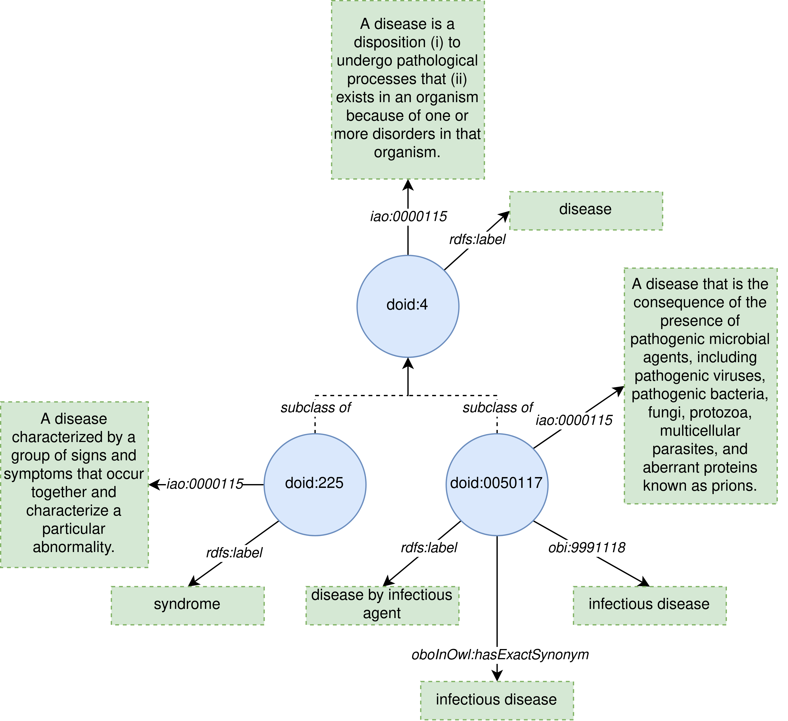

# HURON: HUman Readability ONtologies
*HURON* is a command line java application for ontology metrics calculation. Further details about the metrics are available at  [http://semantics.inf.um.es/huron/docs_metrics.html](http://semantics.inf.um.es/huron/docs_metrics.html).

# Usage
## Command
`java -jar huron.jar --input <arg> [--output-long <arg>] [--output-wide <arg>] [--output-rdf <arg>] [--detailed-files <arg>] [--imports] [--threads <arg>]`

Where

- **--input** Input file, which be an owl ontology, or a folder containing owl ontologies.
- **--output-long** Output tsv file with the metrics in long format with the columns 'ontology', 'metric' and 'value'.
- **--output-wide** Output tsv file with the metrics in wide format, where the metrics are in different columns.
- **--output-rdf** Output RDF file according to [oquo](https://purl.archive.org/oquo) ontology.
- **--detailed-files** Generate a report for each metric in the folder passed as argument.
- **--threads** Number of threads to use in parallel.
- **--imports** Consider imported entities from external ontologies (import clause) when calculating the metrics.

## Dependencies
If you want to test, modify or compile the application from the source code, you will need access to the **ontoenrich-core** library, used by the application to perform the analysis of lexical regularities. The source code of this library is not available yet, but it is supported by several publications:

- [https://link.springer.com/chapter/10.1007/978-3-319-17966-7_25](https://link.springer.com/chapter/10.1007/978-3-319-17966-7_25)
- [https://hal.archives-ouvertes.fr/hal-03155057/](https://hal.archives-ouvertes.fr/hal-03155057/)

You can download this library from [here](https://semantics.inf.um.es/ontology-metrics-libs/ontoenrich-core-2.0.0-SNAPSHOT.jar).

# Online tool
An online version of HURON is available at [http://semantics.inf.um.es/huron](http://semantics.inf.um.es/huron).

# Metrics calculation example
As an example of how the metrics work, lets assume the following ontology:

This ontology is an excerpt of the [Human Disease Ontology](http://www.disease-ontology.org/) consisting of 3 classes that have been annotated with some human-readable content, such as:
  - Names, by using [rdfs:label](http://www.w3.org/2000/01/rdf-schema#label).
  - Descriptions, by using [IAO:0000115](http://purl.obolibrary.org/obo/IAO_0000115).
  - Synonyms, by using [oboInOwl:hasExactSynonym](http://www.geneontology.org/formats/oboInOwl#hasExactSynonym) and [obi:9991118](http://purl.obolibrary.org/obo/OBI_9991118).

This ontology is available [here](src/test/resources/example3.owl), and it has been used for testing the application; the corresponding JUnit test case is available [here](src/test/java/es/um/dis/tecnomod/huron/metrics/DOIDTest.java).

## Names per class
The ontology contains 3 classes, being each one annotated with an [rdfs:label](http://www.w3.org/2000/01/rdf-schema#label), which is considered as a name. Thus the value for the metric *names per class* is calculated as 3 classes over 3 names in the ontology, which results in 1 name per class.

## Descriptions per class
The ontology contains 3 classes, and each one is annotated with one description through the property [IAO:0000115](http://purl.obolibrary.org/obo/IAO_0000115). The value for the descriptions per class metric is calculated as 3 classes over 3 descriptions, resulting in 1 description per class.

## Synonyms per class
The ontology contains 3 classes, doid:4 and doid:225 do not include any synonym, whereas doid:0050117 include two, one annotated through the property [oboInOwl:hasExactSynonym](http://www.geneontology.org/formats/oboInOwl#hasExactSynonym), and another one through [obi:9991118](http://purl.obolibrary.org/obo/OBI_9991118). Then, the ontology has a total of 2 synonyms over 3 classes, resulting in 2/3 synonyms .er class.

## Metrics based on lexical regularities
The ontology contains the lexical regularity `disease' because that text is exhibited in the name of the classes doid:4 (disease), and doid:0050117 (disease by infectious disease). As this lexical regularity matches exactly with the name of doid:4, the class doid:4 is a lexical regularity class. The Lexically Suggest Logically Define (LSLD) and the Systematic Naming metrics are computed over the lexical regularity classes.

### Systematic Naming
The only lexical regularity class of the ontology is doid:4 (disease). This class has a total of 2 subclasses, being one of them doid:0050117 (disease by infectious disease), which exhibit the lexical regularity "disease", and the other one doid:225 (syndrome), which does not exhibit the lexical regularity "disease" in its name. Thus, the ontology has a systematic naming value of 1 class exhibiting the lexical regularity of the parent lexical regularity class over a total of 2 classes that are subclass of lexical regularity classes, resulting in 0.5.

### Lexically Suggest Logically Define (LSLD)
The name of the lexical regularity class doid:4 (disease) is exhibited only by the class doid:0050117 (disease by infectious disease), which is also semantically related with doid:4 (disease) through a subclass axiom. Then, the LSLD value is the ratio between the number of classes that exhibit the lexical regularity of a lexical regulrity class, and the classes that are semantically related with that lexical regularity class. In this case, we only have doid:0050117 (disease by infectious disease) exhibiting the lexical regularity "disease" of the lexical regularity class doid:4 (disease), which is also semantically related with that class, thus resulting a value of 1 for the LSLD metric.
