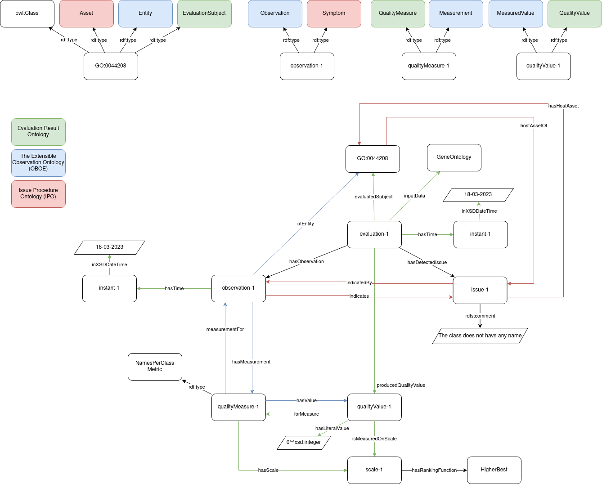

# The oquo-huron ontology
The oquo-huron ontology([https://purl.archive.org/oquo-huron](https://purl.archive.org/oquo-huron)) exteds the Ontology QUality Ontology ([OQUO](https://github.com/tecnomod-um/oquo)) by including the metrics, scales, and scale conversions from Huron[^huron]. This ontology describes the structure of the RDF provided by HURON. The next figure shows an example of a result of applying the metric `names per class' to the gene ontology class GO:0044208:

<!-- img src="../assets/oquo_imports.png" width="600"> -->

[^huron]: [https://doi.org/10.1109/ACCESS.2023.3316512](https://doi.org/10.1109/ACCESS.2023.3316512)